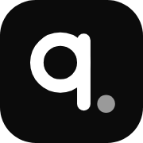

<div align="center">



# Nguyen Minh Quan

**CEO, Odylytics · Venture Analyst, B71 · Research Assistant, HCMUT-URA**

Building technology that protects, and research that ships.

[](https://minhquannguyen.vercel.app/)
[](https://github.com/minhquan-maker)
[](https://www.linkedin.com/in/ngminhquan/)
[](https://orcid.org/0009-0008-9621-1326)

</div>

---

## About

Source code for [minhquannguyen.vercel.app](https://minhquannguyen.vercel.app/), my single-page portfolio. It covers my roles, the Odylytics products, scientific publications, media coverage, awards, education and contact details.

It is plain HTML, CSS and JavaScript: **no build step, framework, bundler, dependencies or environment variables**.

> The previous design is preserved on the [`backup/portfolio-v1-2026-10`](https://github.com/minhquan-maker/myportfolio/tree/backup/portfolio-v1-2026-10) branch.

## Run locally

```bash
git clone https://github.com/minhquan-maker/myportfolio.git
cd myportfolio
python3 -m http.server 8090   # open http://localhost:8090
node -c script.js             # optional: JS syntax check
```

## Page structure

| # | Section | Anchor | What it shows |
|---|---|---|---|
| 1 | **Hero** | `#top` | "Building technology *that protects.*", a short bio, then **See my work**, **GitHub** and **LinkedIn** buttons. On the right sits my portrait, with two team photos behind it (the AquaGuard team at work and the EPICS 8th win) and the AquaGuard, Odylytics and AirGuard logos above |
| 2 | **Band** | — | A black block with a "1,000,000+ people reached" counter and a scrolling marquee: the EPICS winner banner, award plaques and certificates, the UTS feature, team photos and product screens (light 480px thumbnails in `assets/frames/mq/`) |
| 3 | **Logo strip** | — | Odylytics, UTS, HCMUT, ASU, Leave a Nest, ACM, CYTAST, URA |
| 4 | **AquaGuard** (flagship) | `#aquaguard` | Flood alerts, SOS and evacuation guidance. A browser-style mock card plays both demo videos |
| 5 | **About** | `#about` | A dark card with three roles: CEO · Odylytics, Venture Analyst · B71, Research Assistant · HCMUT-URA |
| 6 | **AirGuard** | `#airguard` | Air quality and carbon tracking (gray panel) |
| 7 | **Includio** | `#includio` | Inclusive hiring studio (dark panel), with a link to the live demo |
| 8 | **EnableCode** | `#enablecode` | Hands-free coding with facial gestures. The video is a 1920px HD encode of the original recording |
| 9 | **Voices** | `#voices` | A carousel of AquaGuard testimonials |
| 10 | **Publications** | `#publications` | IEEE KSE 2026 (accepted, oral), DAI 2026 (under review), the HCMUT *Introduction to Computing* textbook, and ORCID |
| 11 | **Media & press** | `#press` | VnExpress, Vietnam.vn, HTV3, Tài Năng Việt, LSTS |
| 12 | **Recognition** | `#recognition` | Seven awards. Each card opens its certificate in a modal; a final card links to the resume |
| 13 | **FAQ** | `#faq` | Tabs for Education, Odylytics, Research and Working together, each with an accordion |
| 14 | **Footer** | `#contact` | A "Let's build it" CTA card, a giant `minhquan` wordmark, an intro line with social icons, and four link columns (Work · Publications · Press · Contact) |

Top nav: About ▾ · Work ▾ · Publications · Press · Recognition · Contact, plus a **My resume** button and a **Settings** button (the sliders icon). On screens ≤900px it collapses into a burger menu, and Settings stays next to it.

## Settings: language, theme, motion

The sliders button in the nav opens a small popover with three segmented controls. Choices are saved in `localStorage` (`mq-settings`), and a tiny inline script in `<head>` applies them before first paint, so there is no flash of the wrong theme or language.

| Control | Options | How it works |
|---|---|---|
| **Language** | English · Tiếng Việt · Français | Every visible string carries a `data-i18n` key. English is read from the page itself; `i18n.js` holds the Vietnamese and French maps. A missing key falls back to English, so proper names and paper titles are simply left out. Switching also updates `<html lang>`, the page title, the meta description, number formatting (1,000,000 / 1.000.000 / 1 000 000), the award-card "View certificate" label and the pixel character's lines |
| **Theme** | Light · Dark · Auto | Sets `<html data-theme>`. Dark mode redefines the colour tokens in `:root[data-theme="dark"]`. Auto follows the OS setting and updates live when it changes |
| **Motion** | Full · Reduced | `data-motion="reduced"` turns off animations site-wide, like the OS `prefers-reduced-motion` setting (which is always respected) |

The panel closes on outside click or Escape. Arrow keys move between options.

## Design

Monochrome and editorial, modelled on the Spyglass landing-page format.

- **Colour:** a white page, black bands and cards, `#F3F3F3` gray panels. The only accent is the green "live" dot (`#2FBF71`). Tokens live in `:root` of `style.css`; a full dark set lives in `:root[data-theme="dark"]`. See `DESIGN.md`.
- **Type:** Inter Tight 600 for headlines, with tight tracking. Each headline's second half is an italic `<em>` in muted gray. Body text is Inter.
- **Shapes:** a floating pill nav, pill buttons, 16–32px radii, soft layered shadows.
- **Favicon:** a custom "q." monogram in `assets/brand/` (SVG plus 32/180/512 PNGs) and a 1200×630 `og.png` for link previews.
- **Pixel me:** a small monochrome pixel version of me walks in at the bottom-left when the page is idle. Click it to get a speech bubble (a black pill). It is hidden on phones and when reduced motion is on.

### Motion

- Hero cards and logos animate in once on load. There is no idle motion.
- `.reveal` elements fade up as they enter the viewport, and the animation replays when you scroll back to them. Children of `[data-stagger-group]` reveal one after another.
- The band counter counts up once. The marquee loops, and pauses on hover.
- Videos with `data-autoplay` play only while they are on screen.
- Everything respects `prefers-reduced-motion`.

### Responsive

| Breakpoint | Changes |
|---|---|
| ≤1024px | Award, press and footer grids tighten; testimonials show two per view |
| ≤900px | Burger nav; hero and feature rows stack; FAQ tabs become a horizontal pill row |
| ≤600px | Compact hero; the logo strip becomes a 4-column grid; press cards become a swipeable row; awards become a two-up grid; the footer has 2 columns; pixel-me is hidden |

## Files

```
index.html        all markup and content (English), each string tagged with data-i18n
i18n.js           Vietnamese + French translations, keyed by data-i18n
style.css         tokens (light + dark) → base → components → sections → motion → responsive
script.js         IIFE modules: i18n, settings, nav, reveal, counter, marquee, video autoplay,
                  scrollspy, testimonial carousel, FAQ tabs, certificate modal, pixel-me
assets/
  brand/          favicon set, og.png, Odylytics / AquaGuard / AirGuard marks
  frames/         stills extracted from the project videos (posters, tiles); frames/mq/ holds the marquee thumbnails
  projects/       project videos and screenshots (aquaguard, airguard, enablecode, includio)
  media/          portrait and team photos
  logos/          partner logos; logos/press/ holds publisher logos
  icons/          LinkedIn, GitHub, ORCID and Facebook icons (Simple Icons SVG)
  certificates/   award PDFs and images opened by the certificate modal
  my_resume.pdf
```

## Editing content

- **Project:** copy a `.feature` section. Choose a white row, a `.panel--gray` or a `.panel--dark`, and give it a `.mock` card. Add a matching link to the Work dropdown and the footer.
- **Video:** use H.264 MP4 with no audio, add `muted loop playsinline preload="none"` plus a `poster`, and set `data-autoplay`. Example encode:
  `ffmpeg -i in.mov -an -vf "scale=1920:-2,fps=30" -c:v libx264 -crf 18 -preset slow -pix_fmt yuv420p -movflags +faststart out.mp4`
- **Testimonial:** add a `.quote-card` to the carousel track. The dots are generated automatically.
- **Publication:** add a `.tool-card` in `#publications`.
- **Press:** add a `.press-card`. Each logo sits on a fixed-size white plate, so any logo works.
- **Award:** add an `.award-card`. Make it `<button class="certificate-trigger" data-cert-url="…">` if there is a certificate. Keep the 4-column grid full.
- **FAQ:** add a `<details>` in the right `[data-faq-panel]`.
- **Any new text:** give the element a `data-i18n="section.name"` key and add the Vietnamese and French strings under the same key in `i18n.js`. Without them, the English text shows in every language.

## Deployment

Vercel serves the repository root as a static site, and every push to `main` deploys. `vercel.json`:

```json
{
  "framework": null,
  "buildCommand": null,
  "outputDirectory": ".",
  "installCommand": null,
  "devCommand": null
}
```

## Contact

- Email: [minhquan.nguyen-2@student.uts.edu.au](mailto:minhquan.nguyen-2@student.uts.edu.au)
- Odylytics: [odylytics@gmail.com](mailto:odylytics@gmail.com)
- [LinkedIn](https://www.linkedin.com/in/ngminhquan) · [GitHub](https://github.com/minhquan-maker) · [ORCID](https://orcid.org/0009-0008-9621-1326)

© 2026 Nguyen Minh Quan. All rights reserved.
